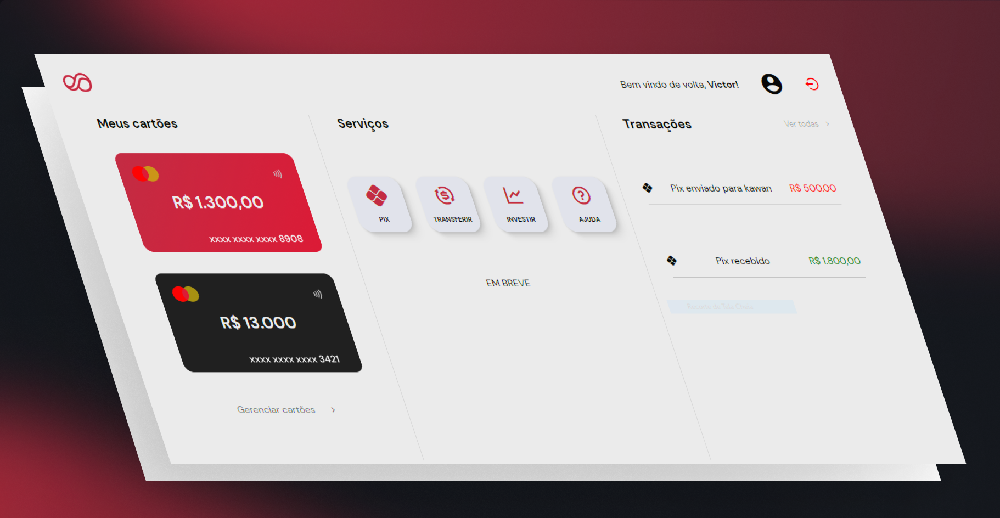

# pyBank

pyBank é um projeto que surgiu de uma ideia nossa, queriamos fazer algo para nos desafiar e então decidimos fazer esse projeto. 
Espero que gostem !

## Desenvolvedores

- [@kawan-lopes](https://www.github.com/kawan-lopes)

- [@joaovirtc](https://www.github.com/joaovirtc)

## Funcionalidades

- Login
- Criar Conta
- Checkout 
- Responsividade
- Envio de Pix
- Multiplataforma

## Stack utilizada

**IDEs:**

**Front-end:**

**Back-end:**

**Banco de Dados:**

## Prévia

